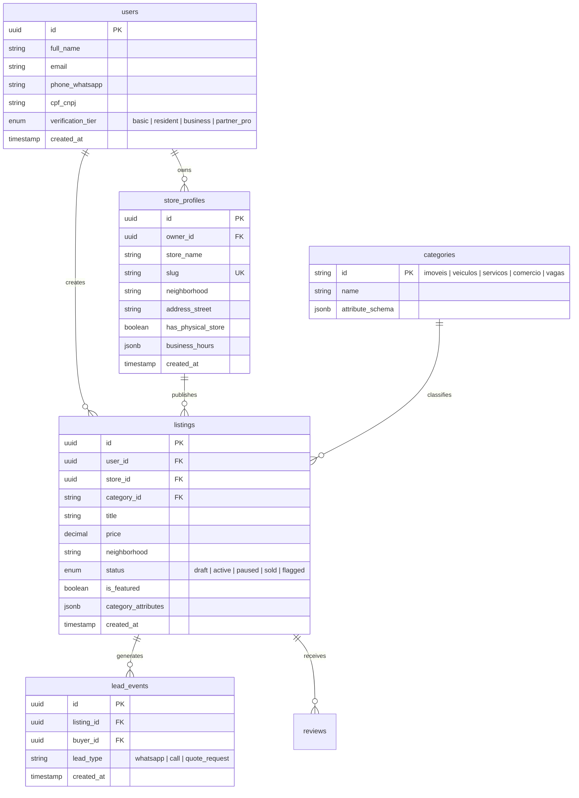

# DATA_MODEL.md — VCA Market Database Schema & Entity Specification

> **PXOS Normative Document**: Defines PostgreSQL schemas, tables, relationships, and JSONB category attribute specifications for **Conquista Market (`vca.market`)**.

---

## 1. Relational Entity Relationship Diagram



---

## 2. Dynamic Category Attributes (JSONB Specifications)

Every listing contains a `category_attributes` JSONB column structured according to its root category:

### 2.1 Imóveis (`category_id: 'imoveis'`)
```json
{
  "property_type": "apartamento | casa | terreno | comercial",
  "transaction_type": "venda | aluguel",
  "usable_area_m2": 85,
  "bedrooms": 3,
  "bathrooms": 2,
  "parking_spots": 2,
  "condo_fee": 450.00,
  "creci_number": "CRECI-BA 12345"
}
```

### 2.2 Veículos (`category_id: 'veiculos'`)
```json
{
  "brand": "Toyota",
  "model": "Corolla",
  "year": 2022,
  "mileage_km": 45000,
  "transmission": "automatico | manual",
  "fuel": "flex | gasolina | diesel | eletrico",
  "fipe_price_reference": 115000.00,
  "has_cautelar_approved": true
}
```

### 2.3 Serviços (`category_id: 'servicos'`)
```json
{
  "specialty": "Técnico de Ar Condicionado",
  "home_service_available": true,
  "pricing_model": "orcamento_gratis | valor_fixo | por_hora",
  "estimated_price": 150.00,
  "portfolio_images": ["url1.jpg", "url2.jpg"]
}
```

### 2.4 Comércio / Produtos (`category_id: 'comercio'`)
```json
{
  "condition": "novo | seminovo | usado",
  "has_warranty": true,
  "pickup_location": "Centro / Bairro Brasil",
  "delivery_available": true
}
```

### 2.5 Vagas (`category_id: 'vagas'`)
```json
{
  "job_title": "Vendedor Comercial",
  "work_model": "presencial | hibrido | remoto",
  "contract_type": "clt | pj | estagio",
  "salary_range": "R$ 2.000 - R$ 3.000"
}
```

---

## 3. Database Indexes & Performance Optimization

* **Neighborhood Search**: `CREATE INDEX idx_listings_neighborhood ON listings(neighborhood);`
* **Category + Status**: `CREATE INDEX idx_listings_cat_status ON listings(category_id, status) WHERE status = 'active';`
* **JSONB GIN Index**: `CREATE INDEX idx_listings_attributes ON listings USING GIN (category_attributes);`
* **Price Range Search**: `CREATE INDEX idx_listings_price ON listings(price);`
