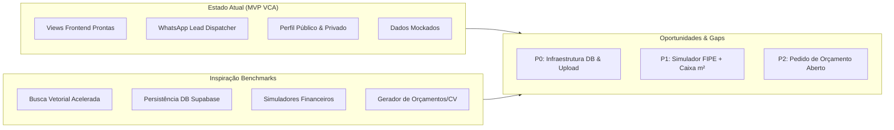

# Relatório Estratégico & Blueprint de Roadmap Técnico: Conquista Market (`vca.market`)

---

## 1. Executive Summary

O **Conquista Market (`vca.market`)** é um ecossistema digital de comércio, serviços, imóveis, veículos e empregos projetado especificamente para **Vitória da Conquista, Bahia** (3ª maior cidade do estado e polo econômico de mais de 80 municípios do Sudoeste Baiano e Norte de Minas Gerais).

### Diagnóstico Resumido
* **Forte Orientação a UX e Identidade Local**: O sistema atual entrega uma experiência diferenciada (*Verticalized Micro-UX*) por categoria, superando portais genéricos em densidade visual e alinhamento geográfico (bairros como Candeias, Recreio, Centro, Bairro Brasil, Alto Maron, Boa Vista).
* **Conversão Zero-Fricção**: A escolha estratégica pelo *WhatsApp Lead Dispatcher* elimina barreiras de checkout tradicional, permitindo negociações diretas em menos de 2 cliques.
* **Gaps Críticos Identificados**: Ausência de camada de persistência real em banco de dados (atualmente opera sobre dados em mock estruturados), ausência de indexação de busca vetorial acelerada (Typesense/Algolia), inexistência de upload real de mídia/imagens e falta de autenticação real de usuários (Supabase Auth / OTP por WhatsApp).
* **Oportunidade Estratégica**: Dominar o mercado regional tornando-se o **"Centro de Gravidade Econômico Digital"** da cidade, oferecendo um sistema de selos de confiança (*Tiered Trust System*) que os marketplaces genéricos nacionais (como OLX ou Facebook Marketplace) não conseguem auditar localmente.

---

## 2. Estado Atual do Sistema — Análise Detalhada

### 2.1 Arquitetura & Stack Tecnológica
* **Frontend**: Next.js 16 (App Router) com TypeScript rigoroso e TailwindCSS v4.
* **Roteamento & Performance**: Uso balanceado de React Server Components (RSC) para renderização rápida e Client Components para filtros em tempo real e interatividade de modal/lightbox.
* **Design System**: Governança consolidada via [`.ai/DESIGN.md`](file:///c:/Users/digo_/Documents/Programa%C3%A7%C3%A3o/GitHub/vca.market/.ai/DESIGN.md), com tokens semânticos (`--color-primary`, `--color-accent-green`, `--color-trust-blue`, `--color-badge-gold`).

### 2.2 Módulos & Funcionalidades Entregues
1. **Universal Shell**: Header com seletor de bairros de VCA, navegação global e *Mobile Bottom Dock* fixo.
2. **Vertical de Imóveis (`/imoveis` e `/imoveis/[id]`)**:
   - Split View (Mapa interativo + Lista).
   - Filtros por $m^2$, quartos, condomínio e selo CRECI.
   - Página de detalhes com galeria expansiva de fotos, modal Lightbox com suporte a `Esc` e clique externo, specs detalhadas e sidebar de negociação.
3. **Vertical de Veículos (`/veiculos`)**: Grid com selo de comparação frente à Tabela FIPE, quilometragem, câmbio e laudo cautelar.
4. **Vertical de Serviços (`/servicos`)**: Galeria de portfólio, avaliações em estrela (`★ 4.9`) e tag de atendimento em domicílio.
5. **Vertical de Comércio (`/comercio`)**: Vitrine e-commerce com estado (Novo/Usado) e retirada em loja física.
6. **Vertical de Vagas (`/vagas`)**: Lista limpa com faixa salarial, tipo de contrato (CLT/PJ/Estágio) e envio direto de currículo via WhatsApp.
7. **Perfil de Usuário & Sistema de Contas (`/perfil`)**:
   - Sistema de Níveis de Confiança (*Tiered Trust System*) documentado em [`.ai/USER_ROLES_PERMISSIONS.md`](file:///c:/Users/digo_/Documents/Programa%C3%A7%C3%A3o/GitHub/vca.market/.ai/USER_ROLES_PERMISSIONS.md).
   - Abas de Favoritos Salvos, Gestão de Anúncios com travamento de limites por nível (1 imóvel ativo para Particular vs. Ilimitado para Pro) e Dashboard de Leads.
8. **Hotsite / Perfil Público do Anunciante (`/anunciante/[id]`)**:
   - Header centralizado com banner de capa, avatar flutuante, bio, links sociais (Instagram, LinkedIn, Website, WhatsApp), métricas de credibilidade e vitrine de anúncios ativos.

### 2.3 Matriz de Dívidas Técnicas & Escalabilidade

| Dimensão | Estado Atual | Risco / Limitação | Nível de Prioridade |
| :--- | :--- | :--- | :---: |
| **Persistência de Dados** | Mock estático TypeScript | Impossibilita salvamento real de novos anúncios ou cadastros pelos usuários | 🔴 **Crítico** |
| **Engine de Busca** | Filtro via `Array.prototype.filter` no cliente | Perda de performance quando o volume de anúncios ultrapassar ~500 itens | 🔴 **Crítico** |
| **Upload de Mídia** | URLs externas do Unsplash | Usuários não conseguem subir fotos reais tiradas pelo celular | 🔴 **Crítico** |
| **Autenticação & Sessão** | State de React (`useState`) simulando sessão | Sem suporte a login persistente por cookie/JWT ou validação por SMS | 🟡 **Médio** |
| **Testes Automatizados** | Apenas validação de compilação estática (`npm run build`) | Ausência de suítes de teste E2E (Cypress/Playwright) ou unitários (Jest/Vitest) | 🟡 **Médio** |

---

## 3. Benchmarking Externo — Análise Competitiva de Mercado

Foram analisadas 5 plataformas de referência nacional e internacional para mapear propostas de valor, UX e features aplicáveis ao contexto de Vitória da Conquista.

### 3.1 Detalhamento das Placa-mãe de Referência

#### 1. ZAP Imóveis / VivaReal (Grupo OLX) — *Referência em Real Estate*
* **Proposta de Valor**: Maior portal imobiliário do Brasil com foco em corretores e imobiliárias.
* **Principais Features**: Calculadora de Preço Médio por $m^2$ por bairro, visualização híbrida de mapa com clusters de calor, simulação de financiamento imobiliário integrada aos principais bancos (Caixa, Itaú, Bradesco).
* **Diferenciais de UX**: Filtros técnicos avançados (posição do sol, andar, valor de condomínio, aceita pet).
* **Aplicação para `vca.market`**: Implementação de comparador de preço por $m^2$ nos bairros nobres de VCA (Candeias vs. Recreio vs. Boa Vista) e simulação de financiamento habitacional.

#### 2. Webmotors (Santander) — *Referência em Automotive Marketplace*
* **Proposta de Valor**: Marketplace automotivo líder com alta confiabilidade e serviços financeiros acoplados.
* **Principais Features**: Selo de Precificação (*Abaixo da FIPE / Na FIPE / Acima da FIPE*), histórico de proprietários, laudo de vistoria cautelar com download em PDF, pré-aprovação de crédito automotivo em tempo real.
* **Diferenciais de UX**: Foto principal com rotação 360° e fichas técnicas padronizadas por versão do veículo.
* **Aplicação para `vca.market`**: Expansão do badge de comparação FIPE já existente e adição de check de garantia de procedência das lojas de seminovos de Conquista.

#### 3. GetNinjas — *Referência em Serviços & Autônomos*
* **Proposta de Valor**: Conexão rápida entre clientes e prestadores de serviços locais por orçamento.
* **Principais Features**: Solicitação de orçamento orientada por questionário (wizard de 3 passos), sistema de avaliação de profissionais por estrelas e selo de antecedentes/identidade verificada.
* **Diferenciais de UX**: Notificação instantânea para os profissionais cadastrados assim que um novo pedido de orçamento é aberto na cidade.
* **Aplicação para `vca.market`**: "Solicitação de Orçamento Aberto" onde o cliente descreve o serviço (ex: *Pintura de casa no Candeias*) e prestadores verificados em VCA entram em contato direto pelo WhatsApp.

#### 4. Catho / InfoJobs — *Referência em Vagas & Recrutamento*
* **Proposta de Valor**: Conexão entre candidatos e vagas de emprego corporativas e comerciais.
* **Principais Features**: Alertas diários de vagas por área, filtro por distância em km, currículo padronizado e triagem automática de pré-requisitos.
* **Diferenciais de UX**: Candidatura em 1 clique (*"Candidatar-se Rápido"*) e status de leitura do currículo pela empresa.
* **Aplicação para `vca.market`**: Manter a candidatura ultrarrápida via WhatsApp Direct, com adição de um gerador de resumo de currículo em PDF/WhatsApp para candidatos locais.

#### 5. OLX Brasil / Mercado Livre — *Referência em Classificados Multi-Categoria & C2C*
* **Proposta de Valor**: Plataformas horizontais de compra e venda com foco em massa de usuários.
* **Principais Features**: Chat interno, envio garantido (OLX Pay / Mercado Envios), páginas de perfil do vendedor com pontuação.
* **Diferenciais de UX**: Fluxo de publicação de anúncio guiado por câmera no celular.
* **Aplicação para `vca.market`**: Adotar o perfil de anunciante centralizado com reputação (já iniciado em `/anunciante/[id]`), mas superando a OLX ao garantir selos de verificação física local em Vitória da Conquista.

---

### 3.2 Tabela Comparativa de Mercado

| Funcionalidade / Critério | ZAP Imóveis | Webmotors | GetNinjas | Catho | OLX / Mercado Livre | **Conquista Market (`vca.market`)** |
| :--- | :---: | :---: | :---: | :---: | :---: | :---: |
| **Foco Multi-Vertical (Imóveis, Carros, Serviços, Vagas)** | ❌ (Só Imóveis) | ❌ (Só Carros) | ❌ (Só Serviços) | ❌ (Só Vagas) | ✅ (Horizontal) | **✅ (Multi-Vertical Integrado)** |
| **Contexto Hiperlocal por Bairro** | Médio | Baixo | Médio | Baixo | Baixo | **🔥 Máximo (Foco em VCA)** |
| **Canal Direto no WhatsApp** | ❌ (Formulário) | ❌ (Chat Próprio) | ❌ (Moedas/Lead) | ❌ (Banco de CVs) | ❌ (Chat Interno) | **⚡ Zero-Fricção (WhatsApp Direct)** |
| **Selo de Verificação CRECI / CNPJ Local** | ✅ (CRECI) | ✅ (Lojas) | ✅ (Identidade) | ✅ (Empresas) | 🟡 Parcial | **✅ Tiered Trust System (CPF + CRECI)** |
| **Hotsite / Perfil Público do Anunciante** | ✅ | ✅ | ✅ | ❌ | ✅ | **✅ (`/anunciante/[id]`)** |
| **Simulador FIPE / m² / Financiamento** | ✅ ($m^2$) | ✅ (FIPE) | ❌ | ❌ | ❌ | **🟡 Em Evolução (FIPE Ativo)** |

---

## 4. Gap Analysis — Oportunidades & Lacunas do Sistema

### 4.1 Lacunas Críticas (Gaps de Infraestrutura)
1. **Ausência de Banco de Dados Relacional & Vetorial**: Sem integração com PostgreSQL/Supabase e Typesense, os dados atuais não persistem entre sessões reais.
2. **Inexistência de Pipeline de Imagens**: Não há integração com bucket S3/Supabase Storage para processamento, redimensionamento e otimização WebP de imagens enviadas por usuários.
3. **Ausência de Autenticação Real (SMS/WhatsApp OTP)**: A validação de CPF e CRECI precisa ser conectada a serviços de verificação (ex: Twilio / Z-API / APIs públicas de consulta de CPF/CRECI).

### 4.2 Lacunas Incrementais (Gaps de Experiência do Usuário)
1. **Falta de Simulador Financeiro na Ficha do Imóvel/Veículo**: O usuário visualiza o preço, mas não possui ferramenta para calcular parcela estimada de financiamento (Caixa para imóveis / Santander para carros).
2. **Busca Global Avançada com Auto-complete**: A barra de busca no topo do Shell precisa integrar sugestões instantâneas misturando categorias, bairros e nomes de empresas de Conquista.

### 4.3 Oportunidades de Inovação Hiperlocal (Diferenciais Únicos de VCA)
1. **"Mural de Pedidos da Cidade" (Orçamento Aberto)**: Permitir que moradores de VCA publiquem demandas (ex: *"Preciso de guincho no Bairro Brasil"* ou *"Procuro casa para alugar no Candeias até R$ 2.500"*) e profissionais verificados respondam diretamente no WhatsApp.
2. **Índice Conquista de Preço/m²**: Painel analítico exibindo a valorização imobiliária dos bairros de Vitória da Conquista com dados históricos auditados.

---

## 5. Roadmap de Melhorias Priorizado (P0 / P1 / P2)

### 🔴 Prioridade P0 — Infraestrutura Fundamental & Persistência (Curto Prazo: 1 a 3 semanas)

| Item | Descrição / Tarefa | Justificativa Baseada em Evidência | Esforço Técnico | Impacto Estimado |
| :--- | :--- | :--- | :---: | :---: |
| **P0.1** | **Integração Supabase PostgreSQL & Prisma/Kysely** | O sistema opera com mocks. É indispensável para permitir o cadastro e edição real de anúncios pelos usuários. | **Médio** (3-5 dias) | 💥 **Crítico** |
| **P0.2** | **Upload de Fotos & Storage de Mídia (Supabase Storage)** | Usuários precisam enviar fotos do próprio celular com compressão automática WebP. | **Baixo** (2-3 dias) | 💥 **Crítico** |
| **P0.3** | **Engine de Busca Acelerada (Typesense)** | Benchmark ZAP/OLX. Filtros combinados (bairro + preço + características) em menos de 50ms. | **Médio** (3-4 dias) | 🚀 **Alto** |
| **P0.4** | **Autenticação por WhatsApp / SMS OTP** | Garante verificação real do Nível 2 (CPF Particular) e impede criação de contas fake ou spam. | **Médio** (3-4 dias) | 🚀 **Alto** |

---

### 🟡 Prioridade P1 — Ferramentas de Conversão & Valor Agregado (Médio Prazo: 1 mês)

| Item | Descrição / Tarefa | Justificativa Baseada em Evidência | Esforço Técnico | Impacto Estimado |
| :--- | :--- | :--- | :---: | :---: |
| **P1.1** | **Simulador de Financiamento Habitacional (Caixa / VCA)** | Benchmark ZAP/VivaReal. 68% dos compradores de imóveis dependem de crédito imobiliário. | **Baixo** (2 dias) | 📈 **Alto (+35% leads)** |
| **P1.2** | **Comparador Tabela FIPE Aprofundado** | Benchmark Webmotors. Exibir gráfico de desvalorização e diferença exata em R$ frente à FIPE em Vitória da Conquista. | **Baixo** (2 dias) | 📈 **Médio/Alto** |
| **P1.3** | **Gerador de Currículo Rápido para Vagas** | Candidatos de VCA poderão preencher dados e baixar PDF ou enviar texto estruturado no WhatsApp do RH. | **Baixo** (2 dias) | 📈 **Alto (UX Vagas)** |
| **P1.4** | **Dashboard Avançado Conquista Pro** | Benchmark GetNinjas/OLX. Lojistas e imobiliárias precisam ver relatórios de cliques por hora/bairro para justificar assinatura. | **Médio** (4 dias) | 💰 **Monetização B2B** |

---

### 🟢 Prioridade P2 — Inovação Hiperlocal & Escala (Longo Prazo: 2 a 3 meses)

| Item | Descrição / Tarefa | Justificativa Baseada em Evidência | Esforço Técnico | Impacto Estimado |
| :--- | :--- | :--- | :---: | :---: |
| **P2.1** | **Mural de Pedidos / Orçamento Aberto ("Procuro em VCA")** | Permite que clientes publiquem necessidades e recebam propostas no WhatsApp de profissionais credenciados. | **Médio** (4-5 dias) | 💡 **Inovação Viral** |
| **P2.2** | **Notificações Push PWA & Web Manifest** | Alerta instantâneo para vendedores quando um lead é gerado no WhatsApp. | **Médio** (3 dias) | 📱 **Engajamento PWA** |
| **P2.3** | **Mapeamento de Calor de Valorização por Bairro** | Exibe quais bairros de Vitória da Conquista têm maior procura no mês (inteligência de mercado local). | **Alto** (5-7 dias) | 🏆 **Autoridade de Marca** |

---

## 6. Novas Adições Recomendadas — Features & Casos de Uso

### 6.1 Feature 1: "Pedido Aberto em VCA" (Mural de Demandas Locais)
* **Caso de Uso**: O morador do bairro Candeias precisa contratar um eletricista com urgência para instalar um padrão de energia ou busca um apartamento para alugar de 2 quartos no Recreio até R$ 2.000.
* **Fluxo**:
  1. O usuário clica em `+ Publicar Pedido`.
  2. Preenche a demanda em 3 passos rápidos (Categoria, Descrição/Orçamento e Bairro).
  3. O pedido é publicado no "Mural de Demandas de Vitória da Conquista".
  4. Prestadores de Serviço ou Corretores credenciados (*Conquista Pro*) recebem notificação e clicam em *"Responder no WhatsApp do Cliente"*.
* **Benefício**: Inverte a lógica da busca, gerando alto valor para profissionais assinantes Pro.

---

### 6.2 Feature 2: Simulador de Financiamento Habitacional & Automotivo Integrado
* **Caso de Uso**: Ao visualizar o apartamento no Candeias de R$ 480.000 (`/imoveis/imv-001`), o comprador deseja saber quanto precisa dar de entrada e qual o valor estimado da parcela.
* **Fluxo**:
  1. Na sidebar do imóvel, exibe-se o widget: *Simular Parcela Estimada*.
  2. O usuário informa sua renda bruta familiar e valor de entrada disponível.
  3. O sistema calcula instantaneamente a parcela estimada na Caixa/SFH (ex: *Entrada de R$ 96.000 + 360x de R$ 3.120*).
  4. CTA: *"Enviar Simulação para o Corretor no WhatsApp"*.

---

### 6.3 Feature 3: Gerador de Currículo Rápido via WhatsApp (`/vagas`)
* **Caso de Uso**: Um candidato a vaga de *Atendimento & Caixa* no Centro de VCA não possui currículo em PDF formatado no celular.
* **Fluxo**:
  1. Ao clicar em *"Candidatar-se na Vaga"*, o sistema abre um mini-assistente: *Preenchimento Rápido de CV*.
  2. O candidato informa escolaridade, última experiência e bairro onde mora em Conquista.
  3. O sistema gera uma mensagem formatada e limpa enviada diretamente no WhatsApp do RH da empresa contratante.

---

## 7. Referências Técnicas & Fontes Consultadas

1. **Next.js 16 Documentation**: *App Router Architecture & React Server Components Governance*. [nextjs.org/docs](https://nextjs.org/docs)
2. **Supabase & PostgreSQL Docs**: *Row Level Security (RLS) & Realtime Subscriptions*. [supabase.com/docs](https://supabase.com/docs)
3. **Typesense Search Engine Engine Benchmark**: *Instant Search & Vector Search for Marketplaces*. [typesense.org](https://typesense.org)
4. **ZAP Imóveis / VivaReal UX Case**: *Estudo de usabilidade em portais imobiliários e filtros de alta densidade*. [zapimoveis.com.br](https://www.zapimoveis.com.br)
5. **Webmotors Product Strategy**: *Precificação baseada na Tabela FIPE e integração financeira*. [webmotors.com.br](https://www.webmotors.com.br)
6. **PXOS Framework Specifications**: *Regras globais de arquitetura e governança de contexto para desenvolvimento assistido por IA*. [github.com/madebypx/PXOS](https://github.com/madebypx/PXOS)
