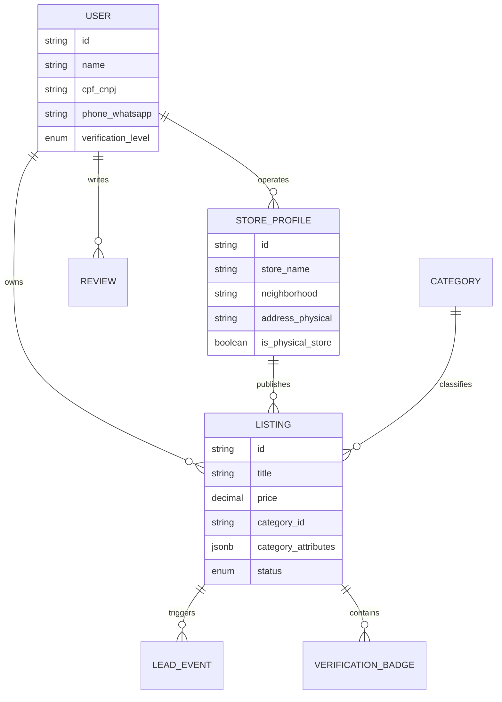
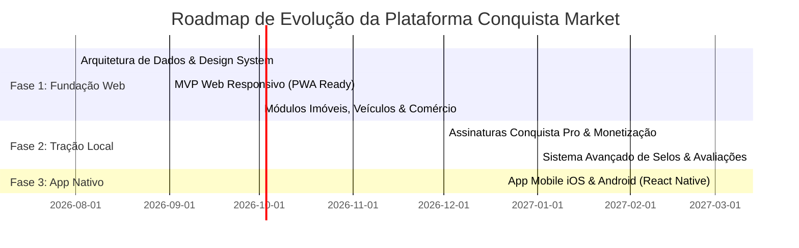

# Product Foundation Specification: VCA Market (Conquista Market)
*Documento de Especificação de Fundação do Produto, Arquitetura de Informação e Sistema de UX*

---

## 1. Product Foundation

### 1.1 Product Definition
**Conquista Market (`vca.market`)** é o ecossistema digital de comércio e serviços hiperlocal de Vitória da Conquista. Trata-se de uma plataforma estruturada que une produtos, imóveis, veículos, serviços e vagas de emprego em uma única infraestrutura com experiências verticais por categoria, alta reputação auditada e atrito zero de conversão.

### 1.2 Core Product Pillars
1. **Verticalized UX Depth:** Nenhuma categoria é tratada como "campo de texto genérico". Cada setor tem campos, modos de visualização, prova social e chamadas para ação (CTAs) próprios.
2. **Hyper-Local Trust Layer:** Sistema de reputação e verificação baseado na geografia e dinâmica comercial real da cidade (bairros, polos comerciais, presença de loja física e histórico local).
3. **Zero-Friction Conversion:** O WhatsApp é o motor principal de negociação. A plataforma atua como o agregador e qualificador de leads mais rápido de Vitória da Conquista.
4. **Professionalization Engine:** Ferramentas que elevam a percepção de valor de autônomos e pequenos comerciantes locais, igualando sua presença digital à de grandes marcas.

### 1.3 Non-Negotiable Strategic Principles
* **Local First, Always:** Toda funcionalidade deve valorizar a geografia de VCA (bairros, zonas de entrega, pontos de referência locais).
* **Speed to Contact > Cart Friction:** Não forçar checkouts ou carrinhos de compra complexos onde a negociação direta ou retirada física é o comportamento natural do usuário conquistense.
* **Trust Through Verification:** Informação auditada vale mais do que volume bruto de anúncios spam.
* **Consistency in Framework, Freedom in Vertical:** A casca e a navegação global são rigorosamente padronizadas; o conteúdo interno do anúncio é altamente adaptável.

### 1.4 Main Tensions & Trade-Offs

| Tensão Estratégica | Escolha de Produto (Trade-off) | Regra Operacional |
| :--- | :--- | :--- |
| **Volume vs. Qualidade de Anúncios** | Priorizar **Qualidade e Relevância** sobre contagem bruta de anúncios. | Limites no plano gratuito + campos obrigatórios de qualificação por categoria. |
| **Flexibilidade de Categoria vs. Coerência da Marca** | Adotar um **Design System Modular** com casca global idêntica. | Alterar apenas widgets internos do anúncio e filtros; topo, busca e footer são imutáveis. |
| **Monetização vs. Experiência de Busca** | Monetizar por **Intenção/Destaque** e não por bloqueio de conteúdo. | Anúncios pagos/patrocinados devem sempre ser etiquetados e manter alta relevância de busca. |
| **Autonomia do Anunciante vs. Padronização de Dados** | **Filtros Estruturados Obrigatórios** em vez de texto livre ilimitado. | Título e preço seguem regras rígidas; descrição aceita markdown livre. |

---

## 2. Information Architecture (IA)

### 2.1 Top-Level Platform Structure
```
vca.market/
├── / (Home: Busca Unificada, Hubs por Bairro, Categorias & Lojas Destaque)
├── /imoveis (Vertical Imobiliária: Mapa, m², Aluguel/Venda, Filtros de Bairro)
├── /veiculos (Vertical Automotiva: FIPE, Ano, Km, Filtros Cautelares)
├── /servicos (Vertical Profissionais: Portfólio, Orçamento, Avaliações)
├── /comercio (Vertical Produtos & Lojas: Catálogo, Retirada no Centro/Brasil)
├── /vagas (Vertical Empregos: Modelo de Trabalho, Requisitos, Envio de CV)
├── /loja/[slug] (Página Conquista Pro: Vitrine do Lojista/Profissional)
├── /anuncio/[id] (View do Anúncio com Micro-UX da Categoria)
└── /painel (Dashboard do Anunciante: Leads, Destaques e Métricas)
```

### 2.2 Navigation Model
- **Primary Header (Global):**
  - Brand identity (`Conquista Market / vca.market`)
  - Seletor Geográfico de Bairro (*"Todo Vitória da Conquista" | "Candeias" | "Centro" | etc.*)
  - Barra de Busca Universal Inteligente (com autocomplete por categoria e palavra-chave)
  - Links de Verticais (*Imóveis | Veículos | Serviços | Comércio | Vagas*)
  - CTA Principal: `+ Anunciar em Conquista`
  - User Menu / Painel Pro

- **Mobile Navigation Bar (Bottom Docked):**
  - `Home` | `Buscar` | `+ Anunciar` | `Mensagens/Leads` | `Perfil`

### 2.3 Core Entity Types


---

## 3. Design System Foundation

### 3.1 Brand & Interface Principles
- **Clareza Hiperlocal:** Priorizar contraste, tipografia legível e cartões bem definidos.
- **Design de Alta Confiança:** Utilizar paleta com azuis profundos (confiança/segurança), acentos vibrantes em verde (ação/WhatsApp/sucesso) e tons neutros aquecidos.
- **Leveza & Performance:** Elementos visuais sem excesso de sombras pesadas; uso inteligente de glassmorphism sutil e micro-interações responsivas.

### 3.2 Dynamic Variation Rules (Global Shell vs. Vertical Variation)

```
┌─────────────────────────────────────────────────────────────────┐
│                     UNIVERSAL PLATFORM SHELL                    │
│   Header Global • Seletor de Bairro • Busca • Auth • Footer     │
├─────────────────────────────────────────────────────────────────┤
│                     VARIABLE CATEGORY MODULE                    │
│                                                                 │
│   [ Imóveis ]        --> Mapa Interativo + Specs (m², quartos)  │
│   [ Veículos ]       --> Comparador FIPE + Km + Câmbio          │
│   [ Serviços ]       --> Portfólio + Média de Estrelas + Proposta│
│   [ Produtos ]       --> Galeria + Badge Retirada + WhatsApp    │
└─────────────────────────────────────────────────────────────────┘
```

* **Universal (Imutável):** Posição de busca, botões de ação global, cabeçalho do vendedor/anunciante, selos de verificação e rodapé.
* **Verticalizado (Variável):** Grid de dados técnicos do anúncio, layout de galeria (imagem principal vs carrossel vs mapa), filtros secundários e formulário de contato preliminar.

---

## 4. Experience Architecture & Key Moments

### 4.1 Key Marketplace Moments

1. **Momento da Descoberta (Search & Filter):**
   - Resposta imediata (< 200ms) com busca híbrida de texto e tag geográfica por bairro de VCA.
   - Filtros dinâmicos que mudam automaticamente ao selecionar uma categoria.

2. **Momento da Decisão (Listing Detail View):**
   - Apresentação da **Ficha Técnica da Categoria** no topo.
   - Exibição visível dos **Selos de Confiança** (CNPJ Verificado, Loja Física no Centro, etc.).
   - Bloco de Prova Social (Avaliações de conquistenses).

3. **Momento da Conversão (Lead Generation):**
   - **WhatsApp Direct Lead:** Ao clicar em *"Falar no WhatsApp"*, o sistema pré-formata a mensagem:
     > *"Olá! Vi o seu anúncio '[Título do Anúncio]' no Conquista Market (vca.market) e gostaria de mais informações."*
   - Captura silenciosa de métricas no painel do anunciante (cliques, leads gerados).

---

## 5. Trust & Reputation System

### 5.1 Matriz de Níveis de Verificação

| Nível de Selo | Requisitos | Exibição na Interface | Benefício no Ranking |
| :--- | :--- | :--- | :--- |
| **Conta Básica** | SMS / E-mail confirmado | Ícone Neutro ("Usuário Registrado") | Ranking Padrão |
| **Vendedor Verificado (Pessoa Física)** | CPF + Celular com WhatsApp auditado | Badge Prata `✓ Morador Verificado` | Prioridade Média |
| **Loja Local Verificada (PME)** | CNPJ + Comprovante de Endereço Comercial em VCA | Badge Ouro `✓ Empresa de Conquista` | Alta Prioridade |
| **Parceiro Oficial / Imobiliária** | CRECI / CRM + Endereço auditado + Contrato Pro | Badge Platinum `✓ Parceiro Oficial Pro` | Máxima Prioridade + Destaque |

### 5.2 Regras de Avaliação e Prevenção de Fraudes
- **Dois Lados com Prova de Contato:** Uma avaliação só pode ser postada após o envio registrado de mensagem/lead na plataforma.
- **Filtro Anti-Spam de Preços:** Preços irreais (ex: R$ 1,00 para carros ou imóveis) são automaticamente marcados para revisão manual ou bloqueados nos filtros de busca padrão.

---

## 6. Marketplace Operating Model & Monetização

### 6.1 Integração de Monetização na Jornada

```
Anunciante Particular (Gratuito) ──► Anuncia Grátis (Até 3 ativos) ──► Opção de Destaque Avulso (R$ 9,90)
                                                                                  │
Lojista / Profissional / Empresa ──► Assina Plano Conquista Pro ────► Vitrine /vca.market/loja + Leads
```

1. **Freemium Equilibrado:** Particulares anunciam gratuitamente com limite de ativos simultâneos.
2. **Destaques de Busca (Boost):** Compra de slots de topo de categoria ou topo do bairro por período determinado.
3. **Assinaturas SaaS Pro:** Faturamento recorrente mensal para empresas e corretores com benefícios operacionais (relatórios, API de importação, página exclusiva da loja).

---

## 7. Category Framework (Matriz de Variação por Categoria)

| Categoria | Modo de Visualização | Filtros Primários | Badge de Prova Social | CTA Principal |
| :--- | :--- | :--- | :--- | :--- |
| **Imóveis** | Mapa + Cards | Bairro, Tipo, $m^2$, Vagas, Valor | CRECI / Imobiliária Verificada | Agendar Visita / WhatsApp |
| **Veículos** | Card com Badge FIPE | Marca, Ano, Km, Câmbio, Preço | Laudo Cautelar / Loja Física | Simular / Falar no WhatsApp |
| **Serviços** | Grid de Portfólio | Especialidade, Atende em Domicílio | Avaliações (Estrelas) + Trabalhos | Solicitar Orçamento |
| **Comércio** | Vitrine de Produto | Bairro da Loja, Condição, Retirada | Loja Física no Centro/Brasil | Comprar / Chamar no WhatsApp |
| **Empregos** | Lista Qualificada | Modelo de Trabalho, Faixa Salarial | Empresa Comprovada | Enviar Currículo / Candidatar-se |

---

## 8. Phased Roadmap (Evolução Faseada)



---

## 9. Estrutura de Documentação do Sistema

Para manter a governança do projeto conforme o padrão PXOS, a documentação interna na pasta `.ai/` é estruturada da seguinte forma:

1. `.ai/PROJECT_CONTEXT.md` - Visão geral, posicionamento, stack e pilares do negócio.
2. `.ai/DESIGN.md` - Design System, tokens visuais, componentes do UI Shell e regras de micro-UX.
3. `.ai/CATEGORY_FRAMEWORK.md` - Matriz detalhada de schemas, campos e regras por categoria.
4. `.ai/TRUST_FRAMEWORK.md` - Regras completas de verificação, selos, avaliações e anti-fraude.
5. `.ai/DECISION_LOG.md` - Registro histórico de decisões de arquitetura e produto.

---

## 10. Prioridade de Entregáveis da Fundação

1. **[Prioridade 1] `.ai/DESIGN.md` & Design System Tokens:** Definir a identidade visual, padrões de componentes e o Shell da interface.
2. **[Prioridade 2] `.ai/CATEGORY_FRAMEWORK.md`:** Mapear o schema JSONB para os dados específicos de cada categoria.
3. **[Prioridade 3] Arquitetura de Banco de Dados (Supabase/PostgreSQL):** Modelagem de entidades (`users`, `listings`, `stores`, `leads`).
4. **[Prioridade 4] MVP Web Shell (Next.js):** Construção da Home, Busca e rotas dinâmicas das verticais.
